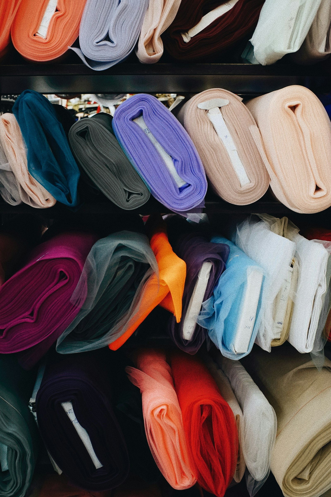

# {{지원 회사}} {{지원 직무}} 지원 — {{이름}}

*Photo · Cosmin Ursea / Unsplash*

{{지원 회사}} 채용 담당자님께,

저는 소재를 먼저 만지고 실루엣을 나중에 그리는 디자이너입니다. 10년 동안 {{브랜드A}}, {{브랜드B}}, {{브랜드C}}에서 일하며 그 순서를 한 번도 바꾸지 않았습니다. 옷은 아이디어에서 시작되지 않고 손에 쥔 원단의 무게에서 시작된다고 믿기 때문입니다.

**무엇을 만들어 왔는가**

제 옷에는 반복되는 특징이 있습니다. {{주력 소재·기법}}, 그리고 몸의 움직임을 따라 흐르도록 계산된 절개선입니다. {{시그니처 아이템}}은 그 방식이 가장 선명하게 드러난 결과물이었고, {{반복 전개 횟수}}시즌 연속 전개되며 라인의 기준점이 됐습니다.

디자인의 완성도를 판단할 때 저는 룩북이 아니라 피팅룸을 봅니다. 모델이 아닌 사람이 입고 팔을 들었을 때 등이 딸려 올라가는지, 앉았을 때 앞판이 뜨는지. 그 3초를 통과하지 못한 옷은 아무리 아름다워도 다시 패턴실로 돌려보냈습니다.

**무엇을 남겨 왔는가**

감각만으로는 10년을 버티지 못합니다. {{브랜드A}}에서 컬렉션을 시그니처–코어–엔트리 세 층위로 재편해 시즌 판매율을 {{판매율 성과}}로 끌어올렸고, 라인 매출 {{매출 성과}}를 만들었습니다. {{브랜드C}}에서는 패턴 단계에 마카 효율 검토를 끼워 넣어 원단 로스를 {{로스 절감 수치}} 줄였습니다. 디자인을 깎지 않고 원가를 맞추는 방법은, 디자인 바깥에 있습니다.

숫자를 말하는 이유는 제가 숫자로 일해서가 아닙니다. 컨셉을 지키려면 컨셉 바깥의 언어를 할 줄 알아야 하기 때문입니다. 저는 벤더와 원단 폭을 놓고, MD와 프라이스 밴드를 놓고 같은 테이블에서 이야기할 수 있습니다.

**어떻게 팀을 굴리는가**

{{브랜드B}}에서 {{팀 규모}}명의 디자인팀을 이끌며 회의에서 "이건 좀 아닌 것 같다"는 말을 없앴습니다. 대신 소재·비율·원가·타겟 중 무엇이 어긋났는지 지목하게 했습니다. 리드의 취향은 물려줄 수 없지만, 판단의 기준은 물려줄 수 있습니다.

주니어에게는 시즌마다 자기 이름을 건 아이템 하나를 끝까지 맡겼습니다. {{육성 사례}}. 팀은 그렇게 만들어졌고, 시즌 기획 리드타임은 {{리드타임 개선}}으로 줄었습니다. 지금 제 이력에서 가장 마음에 드는 줄은 히트 아이템이 아니라 그때 함께 일한 사람들이 지금 어디서 무엇을 하고 있는지입니다.

**왜 {{지원 회사}}인가**

{{지원 회사}}의 {{관심 제품·라인}}을 매장에서 뒤집어 봤을 때 {{구체적 관찰}}을 발견했습니다. 원가 압박 속에서 누군가 끝까지 지킨 선택이라는 걸 알아볼 수 있었습니다. 브랜드의 태도는 그런 곳에 남습니다.

동시에 {{개선 여지}}라는 과제도 보였습니다. 저는 그 과제를 {{브랜드A}}에서 이미 한 번 통과해봤습니다. 컨셉을 흐리지 않으면서 판매 폭을 넓히는 일은 취향이 아니라 구조의 문제였고, 그 구조를 설계하는 것이 제가 다음 10년에 하고 싶은 일입니다.

제 작업의 결은 글보다 실물에 가깝습니다. 포트폴리오를 함께 첨부합니다. 만나서 원단부터 이야기 나눌 수 있기를 기다리겠습니다.

{{이름}} 드림
{{연락처}} · {{이메일}}
포트폴리오: {{포트폴리오 URL}}
