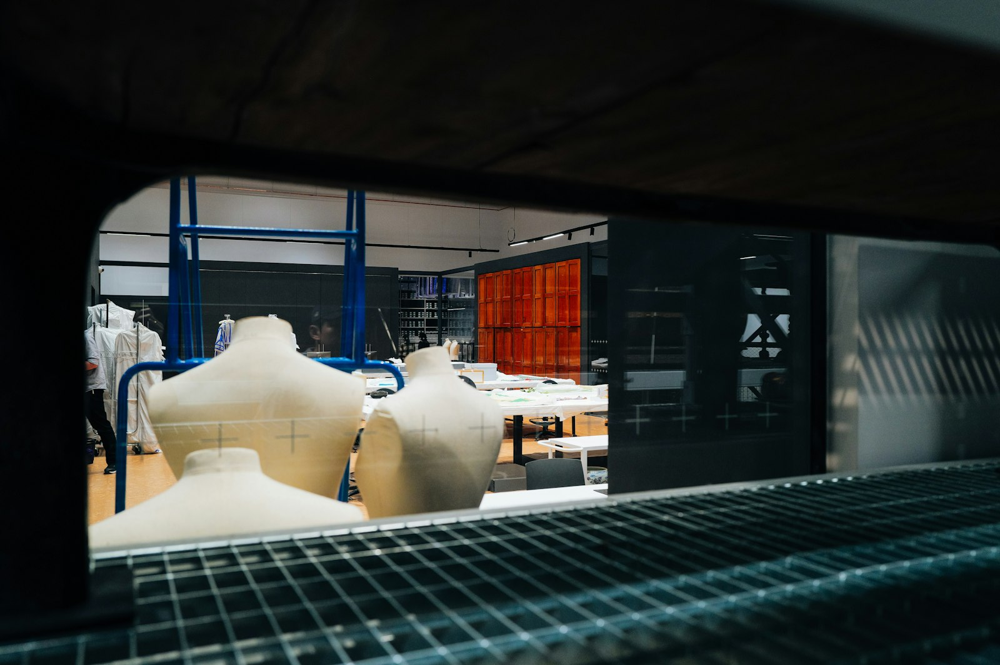

# {{이름}} — Fashion Designer / Design Lead

{{연락처}} · {{이메일}} · 포트폴리오 {{포트폴리오 URL}}

*Photo · Adrien Olichon / Unsplash*

---

## Summary

소재에서 시작해 실루엣으로 끝내는 10년 차 의상 디자이너입니다. {{브랜드A}}, {{브랜드B}}, {{브랜드C}}에서 {{주요 담당 카테고리}}를 맡아 시즌 디렉션부터 생산 협업까지 라인 전체를 책임져 왔습니다. 최근 {{팀 규모}}명 규모의 디자인팀을 이끌며 컬렉션 구조를 재설계해 시즌 판매율 {{판매율 성과}}, 라인 매출 {{매출 성과}}를 만들었습니다. 런웨이의 언어와 매장의 언어를 동시에 구사하는 것이 제 역할이라고 생각합니다.

---

## Experience

| 기간 | 브랜드 | 직급 | 담당 라인 |
|---|---|---|---|
| {{브랜드A 재직기간}} | **{{브랜드A}}** | {{브랜드A 직급}} | {{브랜드A 담당라인}} |
| {{브랜드B 재직기간}} | **{{브랜드B}}** | {{브랜드B 직급}} | {{브랜드B 담당라인}} |
| {{브랜드C 재직기간}} | **{{브랜드C}}** | {{브랜드C 직급}} | {{브랜드C 담당라인}} |

---

## 핵심 역량

### 브랜드 디렉션

시즌 컨셉을 컬렉션 구조로 번역합니다. 시그니처–코어–엔트리 세 층위로 라인을 설계해, 브랜드 언어를 지키면서 판매 폭을 넓히는 방식으로 일합니다. 무드보드보다 스와치 박스를 먼저 여는 것이 제 기획의 출발점입니다.

### 팀 리드십

{{팀 규모}}명 규모 디자인팀 운영. 피드백을 소재·비율·원가·타겟 네 축으로 구조화해 주관적 합평을 없앴고, 주니어에게 시즌마다 독립 아이템을 맡겨 판단력을 키웠습니다. 리드타임 {{리드타임 개선}} 단축, 팀 이직률 {{이직률 개선 수치}} 개선.

### 커머셜 감각

원가와 생산 조건을 디자인 단계에서 함께 계산합니다. 패턴 확정 전 마카 효율을 검토하는 프로세스를 도입해 원단 로스 {{로스 절감 수치}}를 절감했고, 벤더·MD와 같은 지표로 협상합니다.

---

## 대표 프로젝트

### 1. {{브랜드A}} — {{프로젝트A 명}}

- **배경** · 룩북 호평에도 판매가 소수 아이템에 편중, 라인 전체 소진율 정체
- **실행** · 컬렉션을 시그니처/코어/엔트리 3층 구조로 재편, 시그니처의 {{주력 소재·기법}}을 코어에 단순화 이식
- **결과** · 시즌 판매율 {{판매율 성과}}, 라인 매출 {{매출 성과}}, {{시그니처 아이템}} {{반복 전개 횟수}}시즌 연속 전개

### 2. {{브랜드B}} — {{프로젝트B 명}}

- **배경** · 시즌 기획 지연 반복, 디자인 의사결정이 리드 1인에 집중
- **실행** · 피드백 기준 4축 도입, 주니어 캡슐 오너십 제도 운영, 기획 캘린더 재설계
- **결과** · 리드타임 {{리드타임 개선}}, {{육성 사례}}

### 3. {{브랜드C}} — {{프로젝트C 명}}

- **배경** · 샘플 확정 후 원가 초과로 디자인 훼손이 반복되는 구조
- **실행** · 패턴 단계 마카 효율 동시 검토, {{공정 개선 사례}}
- **결과** · 원단 로스 {{로스 절감 수치}} 절감, 디자인 의도 유지한 채 목표 원가 달성

---

## Skills & Tools

- **디자인** · Adobe Illustrator, Photoshop, InDesign
- **3D / 패턴** · CLO 3D, {{패턴 CAD 툴}}
- **전문 영역** · {{주력 소재·기법}}, 패턴 리딩 및 수정 디렉션, 원가 구조 설계, 벤더·공장 커뮤니케이션
- **언어** · {{언어 능력}}

---

## 지원 포지션

**{{지원 회사}} {{지원 직무}}** — 컬렉션의 관점을 책임지고, 그 관점을 팀이 반복할 수 있는 구조로 남기는 자리에서 일하고 싶습니다.
