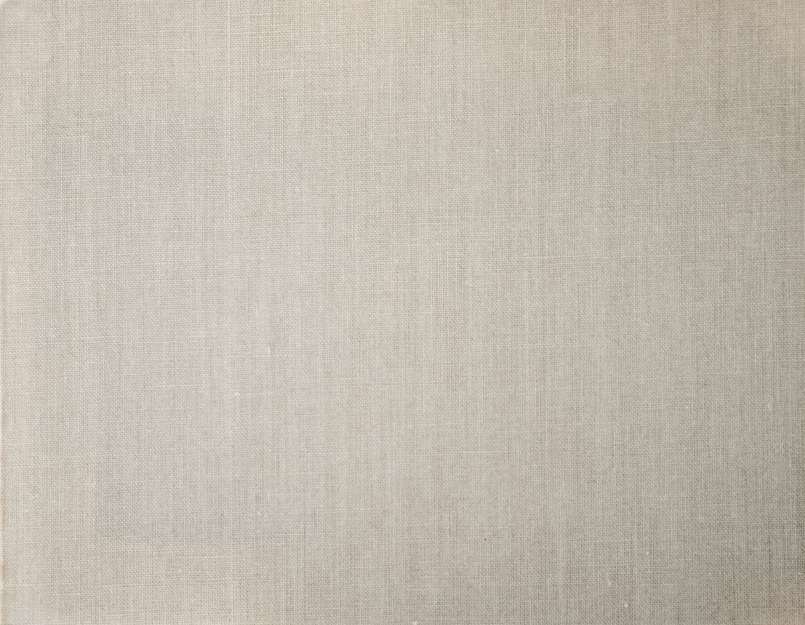
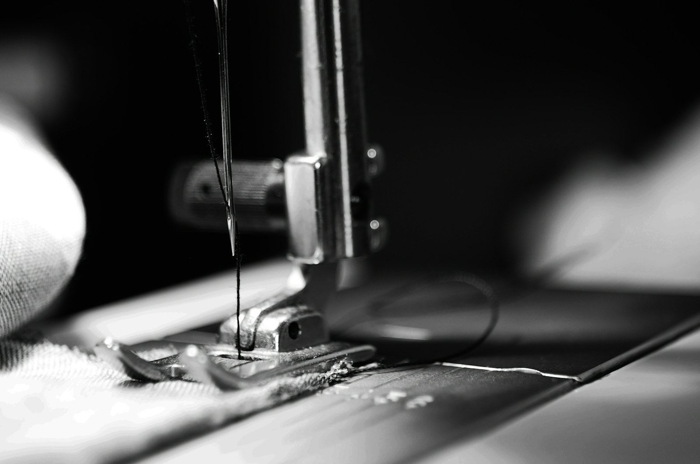

# 자기소개서

**{{이름}}** · 의상 디자이너 10년 · {{지원 회사}} {{지원 직무}} 지원

*Photo · Annie Spratt / Unsplash*

---

## 1. 성장과정 및 가치관

**저는 그림보다 가위를 먼저 잡은 디자이너입니다.**

처음 옷을 만진 건 스무 살, {{첫 경험 장소}}에서였습니다. 그때 제 손에 들어온 건 스케치북이 아니라 시접이 뜯긴 남의 옷이었습니다. 왜 이 소매는 팔을 들면 등이 딸려 올라갈까. 왜 같은 패턴인데 원단이 바뀌면 실루엣이 무너질까. 답을 알고 싶어서 뜯고, 다시 박고, 또 뜯었습니다. 디자인이 종이 위가 아니라 사람의 몸 위에서 완성된다는 걸 그 계절에 배웠습니다.

그 습관은 10년이 지난 지금도 남아 있습니다. 저는 시즌 기획의 첫 단계에서 무드보드보다 스와치 박스를 먼저 엽니다. 소재를 손으로 쥐어 무게와 드레이프를 확인한 뒤에야 실루엣을 그립니다. 감각은 영감에서 오지 않고 축적된 촉각에서 온다고 믿기 때문입니다.

10년 동안 저를 가장 많이 바꾼 것은 잘 팔린 옷이 아니라 팔리지 않은 옷이었습니다. 제가 가장 아꼈던 시즌의 재킷이 매장 걸이에 그대로 남아 있던 날, 저는 그 옷을 사무실로 가져와 다시 뜯었습니다. 비율도 소재도 문제가 없었지만 어깨선이 실제 고객의 골격을 고려하지 않은 선이었습니다. 그날 이후 저는 제 취향을 의심하는 습관을 갖게 됐습니다. 의심은 감각을 무디게 만들지 않습니다. 오히려 매번 근거를 요구하면서 감각을 단단하게 만듭니다.

그래서 제 작업 원칙은 하나로 정리됩니다. **입을 수 없는 아름다움은 만들지 않는다.** 런웨이에서 박수를 받는 옷과 매장에서 팔리는 옷 사이의 거리를 좁히는 일, 그게 10년간 제가 해온 일이고 앞으로도 할 일입니다.

---

## 2. 지원 동기

**{{지원 회사}}는 제가 오래 관찰해온 브랜드입니다.**

{{지원 회사}}의 {{관심 제품·라인}}을 처음 매장에서 봤을 때, 저는 걸이에서 옷을 꺼내 안감부터 뒤집어 봤습니다. {{구체적 관찰}}. 그 디테일은 원가 압박 속에서 누군가 끝까지 지켜낸 선택이었을 겁니다. 브랜드가 무엇을 포기하지 않는지는 그런 곳에서 드러납니다.

동시에 여지도 보였습니다. {{개선 여지}}. 이 지점이 제가 지원한 이유입니다. 저는 {{브랜드A}}에서 {{담당 성과 요약}}을 하며 비슷한 과제를 통과해봤습니다. 컨셉을 흐리지 않으면서 판매 폭을 넓히는 일은 취향의 문제가 아니라 구조의 문제였고, 그 구조를 설계하는 것이 디자인 총괄의 일이라고 생각합니다. 브랜드를 지키는 방법은 아무것도 바꾸지 않는 것이 아니라, 무엇을 바꾸면 안 되는지를 아는 것입니다.

10년 차에 제가 원하는 건 더 많은 옷을 그리는 자리가 아니라, **브랜드의 관점을 책임지는 자리**입니다. {{지원 회사}}가 지금 서 있는 단계가 그 자리를 필요로 한다고 판단했습니다.

---

## 3. 직무 역량 및 경험

*Photo · J Williams / Unsplash*

**① 컬렉션 디렉션 — 컨셉을 매출로 번역하는 일**

{{브랜드A}}에서 {{브랜드A 재직기간}} 동안 {{브랜드A 담당라인}}의 시즌 디렉션을 맡았습니다. 당시 문제는 명확했습니다. 룩북은 호평받는데 판매는 특정 아이템에만 몰렸습니다. 저는 컬렉션을 세 층위로 재편했습니다. 브랜드 언어를 보여주는 시그니처, 그것을 일상 착장으로 번역한 코어, 진입 장벽을 낮춘 엔트리. 시그니처의 절개선과 {{주력 소재·기법}}을 코어 라인에 단순화해 이식하는 방식으로 컬렉션 전체의 톤을 묶었습니다.

결과는 {{판매율 성과}}, {{매출 성과}}였습니다. {{시그니처 아이템}}은 이후 {{반복 전개 횟수}}시즌 연속 전개되며 라인의 기준점이 됐습니다.

**② 팀 리드 — 취향이 아니라 기준을 물려주는 일**

{{브랜드B}}에서는 {{팀 규모}}명 규모의 디자인팀을 이끌었습니다. 리드가 되고 가장 먼저 바꾼 건 피드백 방식이었습니다. "이건 좀 아닌 것 같다"는 말을 금지했습니다. 대신 소재·비율·원가·타겟, 네 축 중 어디가 어긋났는지를 지목하게 했습니다. 디렉터의 취향은 물려줄 수 없지만 판단의 기준은 물려줄 수 있다고 봤기 때문입니다.

주니어 디자이너에게는 시즌마다 자기 이름을 건 캡슐 아이템 하나를 끝까지 책임지게 했습니다. {{육성 사례}}. 팀 이직률은 {{이직률 개선 수치}}로 낮아졌고, 시즌 기획 리드타임은 {{리드타임 개선}}으로 줄었습니다. 좋은 옷은 결국 오래 붙어 있는 팀에서 나옵니다.

**③ 생산·원가 — 공장의 언어를 아는 디자이너**

{{브랜드C}}에서 {{브랜드C 담당라인}}을 맡으며 원가 구조를 직접 들여다봤습니다. 샘플 확정 후 원가가 맞지 않아 디자인이 훼손되는 일이 반복됐기 때문입니다. 저는 패턴 단계에서 마카 효율을 함께 검토하는 프로세스를 도입하고, {{공정 개선 사례}}로 로스율을 줄였습니다.

원단 로스 {{로스 절감 수치}} 절감, 리드타임 {{리드타임 개선}} 단축을 만들면서도 디자인 의도는 그대로 지켰습니다. 벤더·공장과 같은 단어로 대화할 수 있다는 것은 총괄 포지션에서 협상력 그 자체입니다.

---

## 4. 입사 후 포부

**첫 1년 — 브랜드를 해부합니다.**
입사 후 두 시즌은 판단보다 관찰에 씁니다. 지난 {{최근 시즌 수}}시즌의 판매 데이터와 실물 샘플을 나란히 놓고, 무엇이 팔렸는지가 아니라 **왜 팔렸는지**를 정리하겠습니다. 동시에 벤더·MD·영업과 직접 만나 브랜드가 현재 감당할 수 있는 생산 조건의 한계선을 파악하겠습니다.

**3년 — 라인의 골격을 세웁니다.**
시그니처–코어–엔트리 구조를 {{지원 회사}}의 조건에 맞게 재설계해, 매 시즌 다시 처음부터 기획하지 않아도 되는 골격을 만들겠습니다. 이 구조가 자리 잡으면 디자인팀은 소모되는 대신 축적됩니다. {{3년 목표 지표}}를 목표로 삼겠습니다.

**5년 — 다음 사람을 남깁니다.**
제가 없어도 흔들리지 않는 팀이 좋은 팀입니다. 5년 뒤에는 제 밑에서 성장한 디자이너가 독자적으로 라인을 책임지고 있어야 한다고 생각합니다. 브랜드에 남길 가장 확실한 자산은 한 시즌의 히트 아이템이 아니라, 그다음 시즌을 만들 수 있는 사람들입니다. 10년 동안 배운 것을 다음 10년 동안 {{지원 회사}} 안에 쌓아두고 싶습니다.

---

*포트폴리오: {{포트폴리오 URL}} · {{연락처}} · {{이메일}}*
